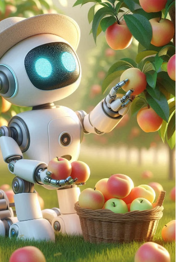
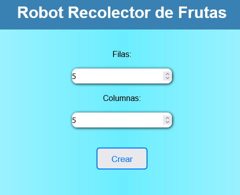
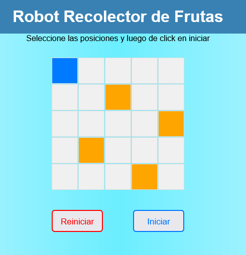

# Formulación de los problemas :sunglasses:
---

La metodología para resolver problemas se ha aplicado a un conjunto amplio de entornos. Podemos definir dos tipos de problemas: `problemas de juguete` y del `mundo-real`.
Un problema de juguete se utiliza para ilustrar o ejercitar los métodos de resolución de problemas. Éstos se pueden describirn de forma exacta y concisa. Esto significa que diferentes investigadores pueden utilizarlos fácilmente para comparar el funcionamiento de los algoritmos.
Un problema del mundo-real es aquel en el que la gente se preocupa por sus soluciones. Ellos tienden a no tener una sola descripción.

## Problema de Juguete :dizzy_face:
---

Tienes un robot que está programado para recolectar frutas en un
pequeño huerto rectangular de 3x3 casillas. El huerto tiene tres árboles:
uno en cada esquina (superior izquierda, superior derecha y la esquina
inferior derecha). El robot siempre empieza en la esquina inferior
izquierda (posición (3,1)) y su objetivo es recolectar todas las frutas
pasando por cada árbol, terminando en la esquina inferior derecha (3,3).

## Resolucion del problema :computer: 

Se creó un algoritmo que permite agregar la cantidad de filas y columnas que deseé el usuario, cabe destacar que por una cuestion de tamaño de pantalla se restringio los valores maximos de cada uno, luego de crear el `campo` la persona debe seleccionar las ubicaciones de los `arboles` para que luego el `robot` recoja las frutas.

### Vista Creación del Campo
---

### Vista del campo creado
---

---

## Espero disfrutes este proyecto :smile: :smile:
---